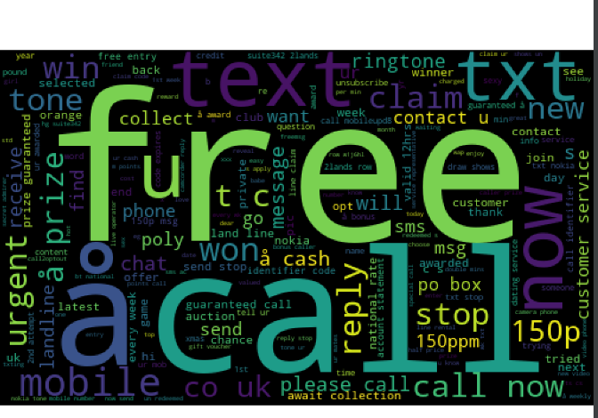
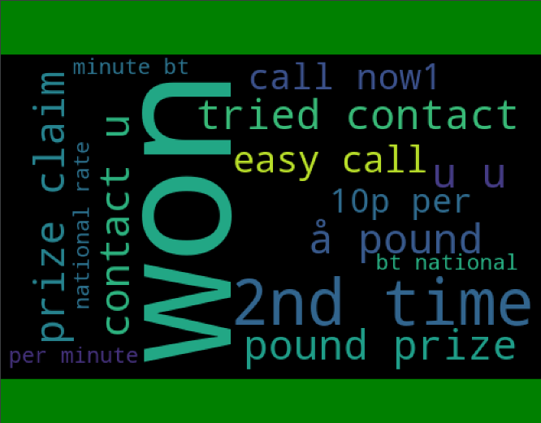
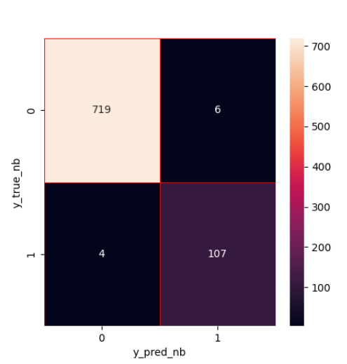

# Projet-Spam-Ham
 Projet Python Anti Spam - machine learning

Nuage de mot Spam

Nuage de mot Ham

Matrice de confusion

Le calcul de la matrice de confusion permet d'évaluer la précision d'une classification.

Avec la matrice de confusion, nous pouvons voir que le modèle Naive Bayes est équilibré.